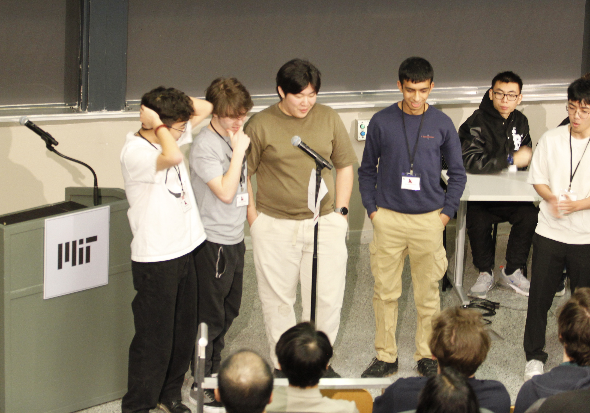

## Introduction

Battlecode is a programming competition ran by students at MIT. Competitors compete to develop the best game playing algorithm over a month long period.

This year, I lead my team 3MiceWalkIntoABar through U.S. Qualifiers into finals. Even though we were knocked out rather quickly in the finals tournament, I'm still extremely proud of where we managed to reach. Our time is made of entirely freshmen competing in Battlecode for the first time. (Paul doesn't even code)

This is a postmortem about our experience, things we tried that worked well, and how to avoid mistakes we made in the future.

If you didn't particpate this year or want an explanation on this year's game, you should read this [brief introduction](./the-game.md).

You can also check out our bot's source code [here](https://github.com/outercloudstudio/battlecode-2026).

This is our team at finals this year. It's not the best picture but you can't see me in any of the other pictures taken TᴖT. In order from left to right: Richard Xun, Liam Hanrahan (Me), Paul Fang Li, Armaan Gomes

## Table of Contents
1. [Sprint 1](./#sprint-1)
2. [Sprint 2](./#sprint-2)
3. [US Qualifiers](./#us-qualifiers)
4. [Final Tournament](./#final-tournament)
5. [Pathfinding](./#pathfinding)
6. [Combat Micro](./#combat-micro)
7. [Communication](./#communication)
8. [Economy](./#economy)
9. [King Macro](./#king-macro)
10. [King Micro](./#king-micro)
11. [Dealing With Cats](./#dealing-with-cats)
12. [Reflection](./#reflection)

## Sprint 1

## Sprint 2

## US Qualifiers

## Final Tournament

## Pathfinding

## Combat Micro

## Communication

## Economy

## King Macro

## King Micro

## Dealing With Cats

## Reflections

