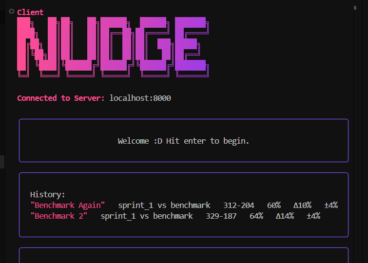
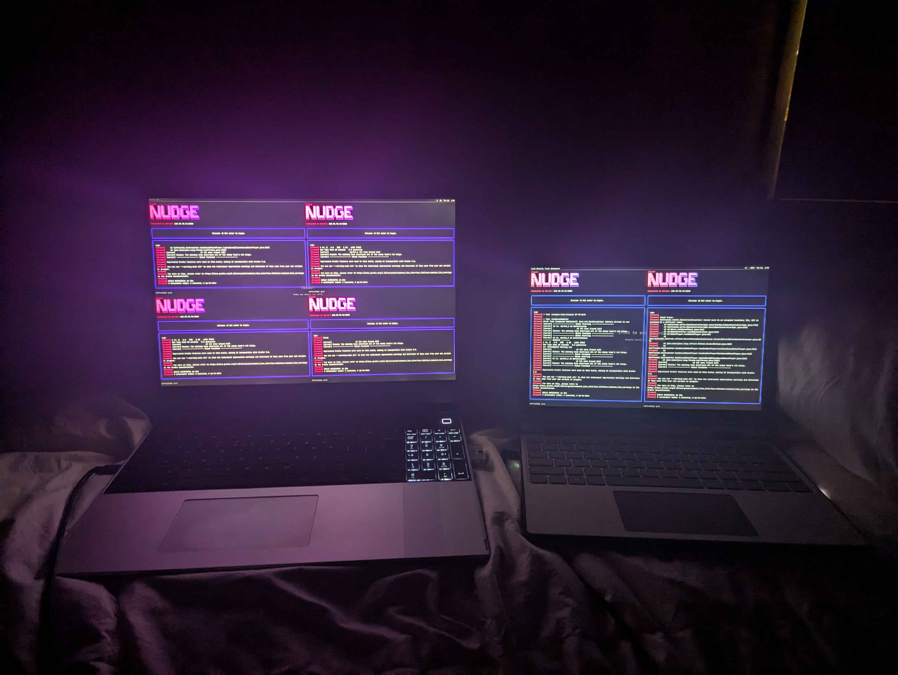
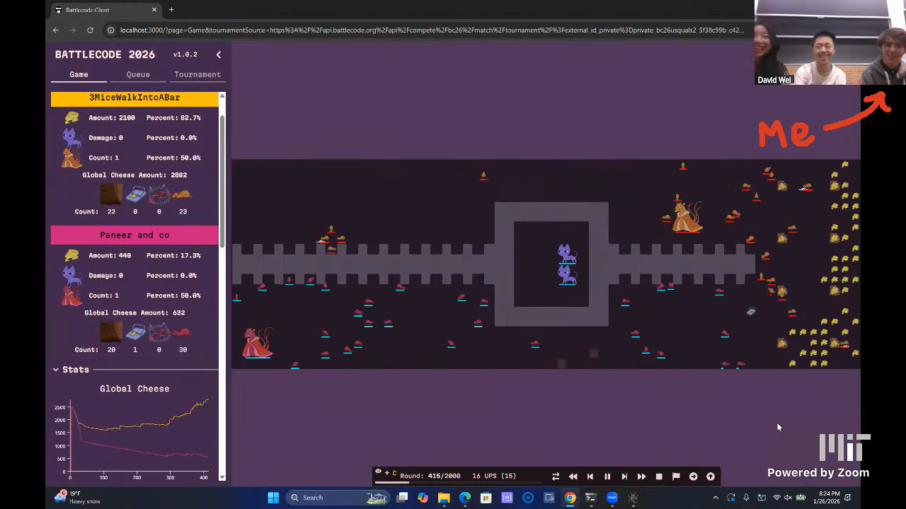
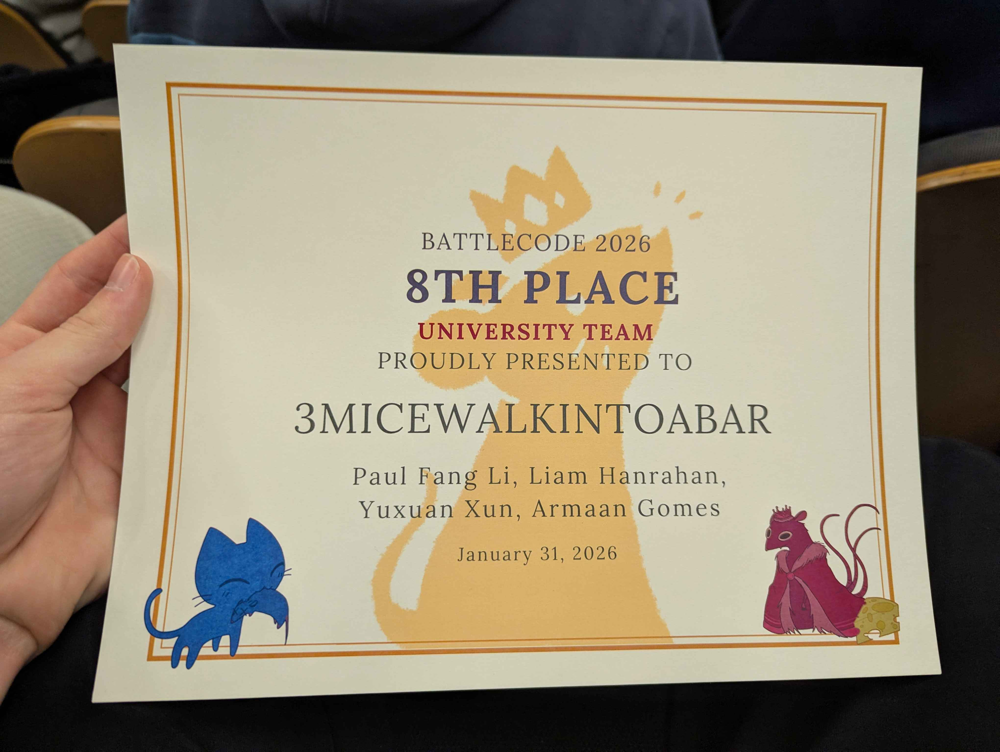
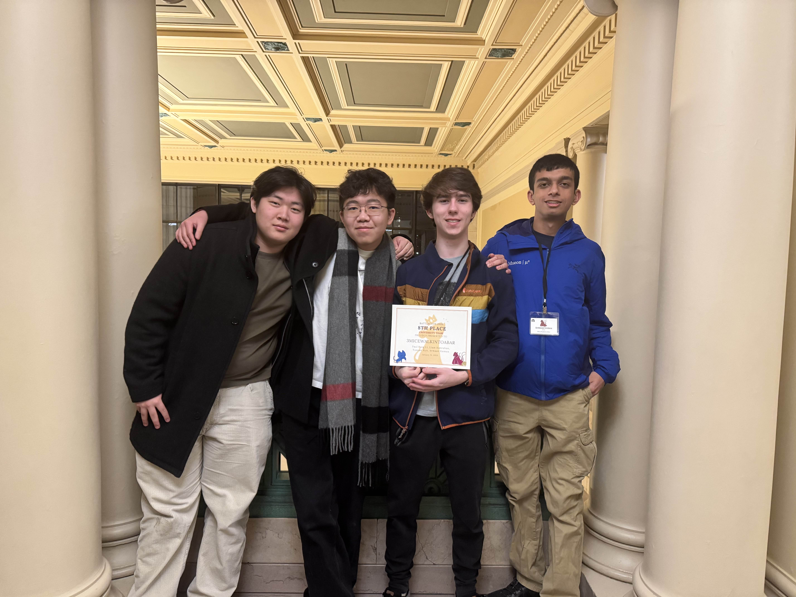

## Introduction

Battlecode is a programming competition ran by students at MIT. Competitors compete to develop the best game playing algorithm over a month long period.

This year, I lead my team `3MiceWalkIntoABar` through U.S. Qualifiers into finals. Even though we were knocked out rather quickly in the finals tournament, I'm still extremely proud of where we managed to reach. Our team is made of entirely freshmen competing in Battlecode for the first time. (Paul doesn't even code)

This is a postmortem about our experience, things we tried that worked well, and how to avoid mistakes we made in the future.

If you didn't particpate this year or want an explanation on this year's game, you should read this [brief introduction](./the-game.md).

You can also check out our bot's source code [here](https://github.com/outercloudstudio/battlecode-2026).

<div style="height: 30px;"></div>


<div style="max-width: 30rem; margin: auto auto">This is our team at finals this year. It's not the best picture but you can't see me in any of the other pictures taken TᴖT. In order from left to right: Richard Xun, Liam Hanrahan (Me), Paul Fang Li, Armaan Gomes</div>

<div style="height: 40px;"></div>

## Table of Contents
1. [Sprint 1](./#sprint-1)
2. [Sprint 2](./#sprint-2)
3. [US Qualifiers](./#us-qualifiers)
4. [Final Tournament](./#final-tournament)
5. [Pathfinding](./#pathfinding)
6. [Combat Micro](./#combat-micro)
7. [Communication](./#communication)
8. [Economy](./#economy)
9. [King Macro](./#king-macro)
10. [King Micro](./#king-micro)
11. [Dealing With Cats](./#dealing-with-cats)
12. [Reflection](./#reflection)

-----

## Sprint 1
During sprint 1 we worked on establishing a good foundation for our bot. This included setting up the important systems like pathfinding, communication, combat micro, and basic economy. Throughout the competition, we worked on improving these primatives, but our bot remained very similar foundationally to how we structured it during sprint 1.

Once the ranked leaderboard opened after a few days, we remained consistently in or near the top 10 teams. For a while at the beginning we hovered from 4th-7th place.

<div style="height: 10px;"></div>


<div style="height: 10px;"></div>

One strategy that was especially powerful during sprint 1 was a full rush. Many teams did not have strong enough micro to counter and the sprint 1 maps were all rather open and rotationally symmetric. This was curbed later with more complicated maps and better defense.

### State Machine
Behaviour within our bot was handled with an extremely simple state machine. Essentially, every tick a rat would check which state was stored within the `state` variable and execute code for that state. We also stored a `previousState` which could allow the bot to remember and later resume a state if it got interrupted by the `fleeingCat` state. Looking back while writing this I realize we could have very easily made this a switch statement and saved some bytecode.

Here's what it looks like:

```java
public class BabyController {
    public static String state = "locateCheese";
    public static String previousState = "locateCheese";

    private static void goToState(String newState) throws GameActionException {
        state = newState;
        previousState = newState;

        // run any code that should happen when newState is entered
        // ...
    }

    private static void goToStateTemporary(String newState) throws GameActionException {
        state = newState;

        // run any code that should happen when newState is entered
        // ...
    }

    public static void run(RobotController rc) throws GameActionException {
        while(true) {
            if (state.equals("locateCheese")) {
                if(rc.getRawCheese() > 0) {
                        goToState("returnCheese");
                }

                // ...
            }
        }
    }
}
```

### Economy
We experimented with various different economy strategies during sprint 1. Initially rats would begin in the `explore` state. In this state they would pick random locations on the map to travel to. Once they saw a cheese mine, they would enter the `communicateCheeseMineState`. In this state, rats would run back to the king and squeak the cheese mine. (More on communications later) Then, the rat would then locate, collect, and return cheese using the `locateCheese`, `pickupCheese`, and `returnCheese` states. Rats would also try to collect multiple cheese before returning.

Later after analyzing games we realized that we were losing out on cheese by keeping locating mines and collecting cheese as seperate behaviours. So, we combined them and it helped collect cheese a bit faster. We also observed that some of the top teams were not collecting multiple cheeses. We ended making this change and then never investigating it later.

### Pathfinding
Pathfinding actually remained almost unchanged after sprint 1, except for tweaks to bugnav at the very end before U.S. qualifiers.

Our pathfinding began by running a [Breadth First Search](https://en.wikipedia.org/wiki/Breadth-first_search) expansion on adjacent nodes originating at the rat. This was repeated 25 times, essentially expanding the search to 25 tiles. Every expansion marked the cell it expanded with an integer that increased for each iteration. We also tracked and updated which expanded cell was closes to the target location. Then, after expansion we found the path from this closest cell back to the rat by at every step, picking the tile with the lowest number until eventually we reached back to the rat.

Normally expansion would cost an unreasonable amount of bytcode, however I came up with an optimization early on that allowed us to do this with no code generation. Essentially, whenever a rat sees a obstacle like a wall, it records this obstacle into a `Map` structure. This structure is an array of `chars`, but what's important is we have a list of essentially groups of bits which we can look up based on a tile's position. Instead of simply storing if the tile was passible, we can store passability to other tiles. Here's what each bit represents:
0. Is this tile impassable
1. Is the tile to the `North` impassable
2. Is the tile to the `East` impassable
3. Is the tile to the `West` impassable
4. Is the tile to the `South` impassable

Then, in expansion we can do a switch over this `char`. This saves a lot of bytcode because it doesn't check the map during expansion, and we don't need to do seperate if statements or map reads for the different directions.

<div style="height: 10px;"></div>


<div style="height: 10px;"></div>

If this `Breadth First Search` failed because it couldn't find a better move, the rat would fall back to a stupid weird bugnav pathfinding I wrote on the first day. This was eventually changed out for `bugnav 0` before U.S. Qualifiers.

<span class="newsreader">A note on king pathfinding:</span> At first glance pathfinding a 3x3 unit might seem significantly more complex, however we can use the same exact pathfinding code for the king. The only thing we need to change is how we store obstacles. Whenver the king sensed an impassable obstacle, it would mark down a 3x3 location centered on the obstacle as impassable into the map structure.

<span class="newsreader">Temporary obstacles:</span> More on how we dealt with nonpermanent obstacles such as dirt and units later.

### Cats
During sprint 1, cats were extremely broken. They were super aggressive, but would also often brick next to a wall and get stuck there. We used two strategies to mitigate cats. First, if a rat saw a cat, it would run at half speed in the opposite direction of the king while squeaking. The idea here was to attempt to lead the cat to the other team's king and hope that it would disrupt their side. In retrospect I don't think this ever worked very well since the cats were too unpredictable and rats were easily disrupted by enemies. 

Our second strategy was to try and detect if a cat had gotten stuck on a wall. If a rat noticed that it was fleeing multiple times from the same cat who had not moved, it would treat the cat and it's neighboring tiles as an impassable wall and then otherwise ignore the cat. This did help a bit to mitigate economic disruption from a cat bricking on your side and preventing rats from returning to the king.

### Communications
Richard wrote the original communications implementation although Me and Armaan all had a hand in expanding and improving on it later.

Rats would squeak to signify mine location to the king, cat locations to fellow rats (although this was later removed), and enemy/ally locations during combat. We experimented with the idea of creating a mesh network where messages would have a `ttl` and information about the map would be constantly passed around, however this was scrapped since it made the cats more aggressive against us. Before U.S. qualifiers, the cat's behaviour was changed to be less agressive so squeaking more became viable. Unfortunately we didn't have to time to reimplement and test our network idea.

Most of communications dealt with sharing information from the king to rats through the global array. Everything we wanted to store in the global array essentially had a bit index in the global array and could be read or written to at that bit index. We had handlers to read and write arbitrary bits so that we could store information continously across the elements. Withing the global array we stored the kings position, mine locations, and a panic mode flag. (Panic mode would trigger if a cat was right next to the king and cause rats to either run or try and attack the cat). We would later expand the king position to allow for multiple positions to support multiple king. We also added a `priority mine`. More about these later. Mine locations were stored continously and enough space was reserved to store up to 8 mine locations. A part of the global array also stored the amount of mine locations currently in the global array. We ended up not using even half of the global array's capacity. We could have done a lot more here or simply added support for storing more mines.

We actually had support within our global array to allow for `unit types` designated by the king when new rats were built, however we never ended up implementing any distinct rat types for the baby rats.

-----

## Sprint 2
Sprint 2 was sort of a mess for us. Early in sprint 2 we found some good improvements. Watching some of `Super Cow Power`'s games, we noticed some interesting techniques. First, rats could collect cheese that was adjacent, not just under them. We also noticed rats could return cheese to the king from a few blocks away. Most importantly though, we noticed a interesting movement technique.

### Careful Movement Strafing
Rats had a mechanic where if they moved in a direction they were not facing, they would incur an additional movement penalty. However, this only occured when attempting to move. Since we can control the order of our actions, we could alternate rotating or moving first to essentially get extra vision range, without a movement penalty.

```java
public class BabyController {
    public static boolean lookLeft = false;

    public static void moveSmart(Direction direction) throws GameActionException {
        if(rc.getDirection() != direction && rc.canTurn(direction)) {
            rc.turn(direction);
        }

        if (rc.canMove(direction)) {
            rc.move(direction);
        }

        if(rc.canTurn()) {
            if(lookLeft) {
                rc.turn(direction.rotateLeft().rotateLeft());
            } else {
                rc.turn(direction.rotateRight().rotateRight());
            }

            lookLeft = !lookLeft;
        }
    }
}
```

### Dealing with Dirt
We also made it a priority to handle dirt on the map. Previously we had simply treated dirt as a permanent impassable obstacle. First we changed pathfinding to treat dirt as passable. Then rats would simply dig dirt if they had to. We also gave the king the ability to place dirt when moving away from a cat. This turned out to be extremely effective with protecting the king.

### Taking a Break and Goat Hacks
Partway into sprint 2, I had my flight from California to Massachusetts to partcipate in WPI's hackathon called Goat Hacks. This meant I wasn't able to work on the bot for about 4-5 days. During this time, we dropped from top 10 in ranked to somewhere around 60th place. One the bright side, Me and Paul had a lot of fun creating a DIY live streaming camera doorbell and winning JBL Charge 6 speakers for `Best Hardware`.

<div style="height: 10px;"></div>


<div style="height: 10px;"></div>


<div style="height: 10px;"></div>

We now own way too many speakers.

### Disaster
Once Goat Hacks ended, we realized we were in a dire situation. First, our bot seemed to almost be doing worse against some of it's previous benchmarks. Second, we were not in a good spot rating wise. I figured that somewhere in the last few days we had introduced multiple bugs into the bot that were significantly impacting performance. Part of the reason this happened is that when testing locally, there was often enough local variation to make a bad change look as if it improved the bot. This is what motivated me to start developing our own game runner and tester.

### Developing a Tester
The first prototype for [Nudge](https://github.com/outercloudstudio/nudge) was developed in a single night. Using the prototype tester, we went through all the recent commits and isolated which ones reduced the win rates. Analyzing these commits revealed a number of bugs. After fixing these the win rate went from under 50% against our benchmark to close to 70%. We submitted this fixed version just in time to make it into sprint 2.

I then spent the next few days learning Go to create a friendly interface for the runner. 

<div style="height: 10px;"></div>



<div style="height: 10px;"></div>

I also rewrote the runner to run distributed across multiple machines and make it more user friendly by making it resistant to connections issues. (The moment we tried testing together Richard and Armaan tried queueing tests at the same time, breaking everything)

Running with our entire cluster got us up to a speed of 1.2 games per second. We were able to run test of 300-500 games in 5-15 minutes depending on how many devices were connected.

<div style="height: 10px;"></div>



<div style="height: 10px;"></div>

Once we were able to use Nudge, our policy for making modifications to the bot changed. We implemented the policy where all changes had to be made on a seperate branch with accompanied with a pull request. We made sure that before we merged any changes, the tester gave us confidence that the change improved the win rate. We used a 95% confidence interval on the win rates to make this decision.

After Nudge was ready for proper use, I went ahead and made it open source and available to everyone. Here's the [repository](https://github.com/outercloudstudio/nudge). I had seen other teams mentioning using game runners and thought that it would hopefully level the playing field a bit if everyone got access to a runner. I know of at least two other teams that ended up using or trying out Nudge, which is pretty awesome.

I do want to make an imporant point about game runners though. Using a game runner is NOT necesary, at all. Most of the teams in the finals did not use a game runner. Using a game runner to help improve your bot can be helpful, like it helped us discover bugs in our bot, but making actual fundamental improvements to your bot outstrips any benefit you gain by using a runner. I've heard that `Teh Devs` are a bit worried that game runners might create a situation where those who can afford the most compute are benefitted. However, this is certainly not a problem yet. I believe we might have been the only team in the finals that used a game runner.

### Combat Micro
Our combat micro was essentially split up into 3 stages. First, if our rat was holding an enemy rat, we would calculate the best direction to throw. This was done by giving a weight to each possible throwing direction and picking the highest one. The weights were based on wether an enemy was in the line of the throw, the thrown rat would hit a wall, and if allies were in the way. If a rat could throw, it always would. Next, we would decide a direction to move. This was also determined by picking the highest value direction (including not moving). The values of each move were calculated by factors such as:
- being next to an enemy
- in vision of enemy
- behind enemy
- spacing rules to prevent `reactions`
- moving towards enemies
- moving towards allies

Then the rat would move. After moving, the rat would begin to act. First, it would pick an enemy based on a score. Closer enemies were always weighted higher, otherwise we simply pick the enemy with the lowest health. Once an enemy is picked, the rat would try and pick up this enemy. If it couldn't it would then try and attack the enemy.

During combat, our rats would squeak out a `micro` squeak. This would signify enemy positions to nearby rats. If rats heard this squeak they would attempt to join the combat and also factor in the positions learned from squeaks in their movement.

One issue we noticed is that sometimes rats could get stuck in micro trying to attack rats through walls that they would never be able to reach. To combat this, we added an `exhaust` timer where if a rat had not acted for a certain number of rounds, it would leave combat and go on cooldown for a few turns.

Our combat micro was okay, but it clearly wasn't strong enough. I think this was the main limiting factor preventing us from reaching a higher place in the finals. We saw especially later on that we would often simply lose fights to teams with better micro. I actually noticed this rather early on and spent a lot of time trying to improve our code. I rewrote it multiple times and even took a look at some past teams combat code. Nothing I tried worked. Next year, this is definitely one of the things I want to prioritize.

### Temporary Obstacles
One aspect I added later to pathfinding was handling units as `temporary` obstacles. Essentially in our representation of the map, I added a cyclic queue structure where locations could be pushed onto the queue. Every tick, all the locations pushed on the queue during the same tick at the end of the queue were popped off and cleared from the map. This delay was set to 5 ticks. So any location a unit was occupying was considered occupied for 5 ticks. This helped reduce congestion in our pathfinding.

-----

## US Qualifiers
The prepartion for U.S. qualifier consisted almost entirely of trying to improve our combat micro. Which sadly for us, did not actually improve. However, I did improve our fallback pathfinding by swapping out my day 1 pathfinding for an actualy bugnav 0 implementation. We also managed to implement some handling to allow for multiple kings, although it was extremely basic. If we had enough global cheese, then all baby rats would always try and form a new king every tick. Communications also had support for storing multiple king locations so rats could choose a king to return cheese to. Our code to attack cats was also extremely buggy so we made a lot of improvements in that area so that our rats would actually team up to kill cats if favorable conditions were met.

I actually got to commentate in person at U.S. Qualifiers. (Perks of showing up in person) I even commentated our own game that qualified us for finals!



<div style="height: 20px;"></div>

-----

## Final Tournament
The final tournament was really fun. We got to celebrate Paul's birthday together in person since Richard had flown here from Georgia for the tournament. (We played a few magic drafts) We also got to meet a lot of really cool people, both competitors and representatives from sponsors.



<div style="height: 20px;"></div>

-----

## On String Builders and Code Generation
So during this contest I set a few goals for our team. First, all of the code we wrote would be completely our own. Up until the very end when I briefly looked at past particpant's combat micro, everything we had written was made completely uninformed by past battlecode years. Second, none of our code was written by AI. Third, we used no string builders. I do worry eventually string builders will be banned. I think they are a bit unfairly overpowered at the moment. This wouldn't be an issue if they weren't also extremely slow. Part of the reason we could even run game tests was because our bot didn't abuse string builders. I also don't want to rely on them heavily because we might see string builders banned or at least reworked in the future. (If they aren't by the time I become a dev I will do something about them) Fourth, we used no code generation. I don't think code generation is really an issue, I just didn't want to deal with setting up code generation. It's very possible we'll use some code generation in the future though.

-----

## Reflections
I am super proud of the team and where we managed to place. We had so much fun. Thanks to **Teh Devs** for making this experience possible. One day I hope to become a dev as well, but I'm going to have to participate a few more times. I wouldn't want to miss out on the oppurtunity to compete a few more times.

<div style="height: 10px;"></div>



<div style="height: 10px;"></div>

Thank you to Richard, Armaan, and Paul for being on my team. It was a lot of fun working with you guys.

<div style="height: 10px;"></div>

<span class="newsreader">And to the future teams of next year, watch out. We're gunning for #1.</span>

<div style="height: 60px;"></div>