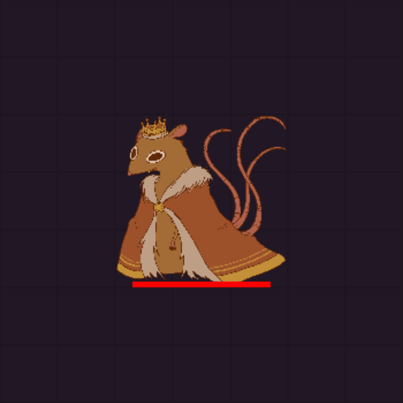
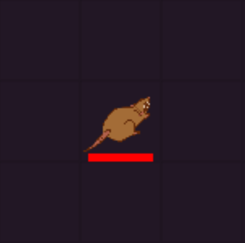
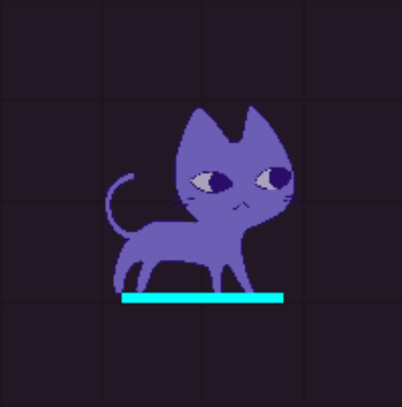
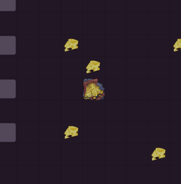
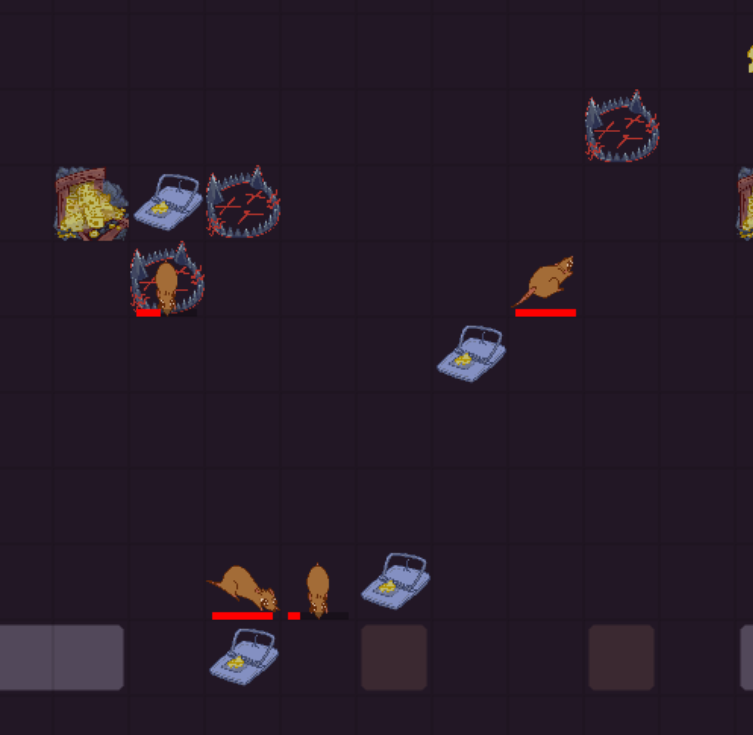
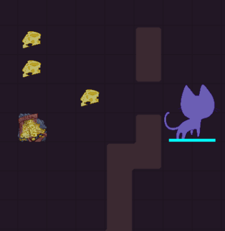
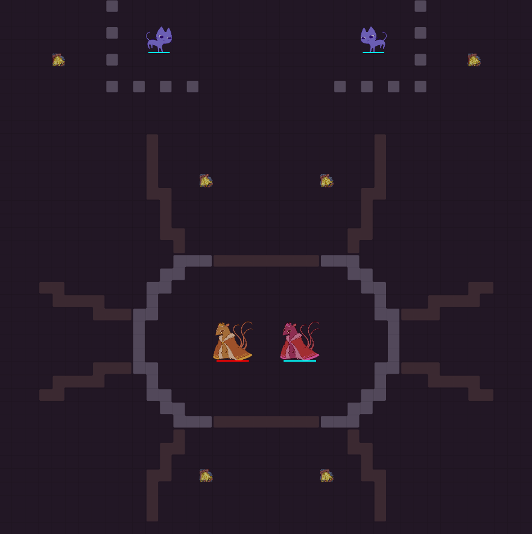
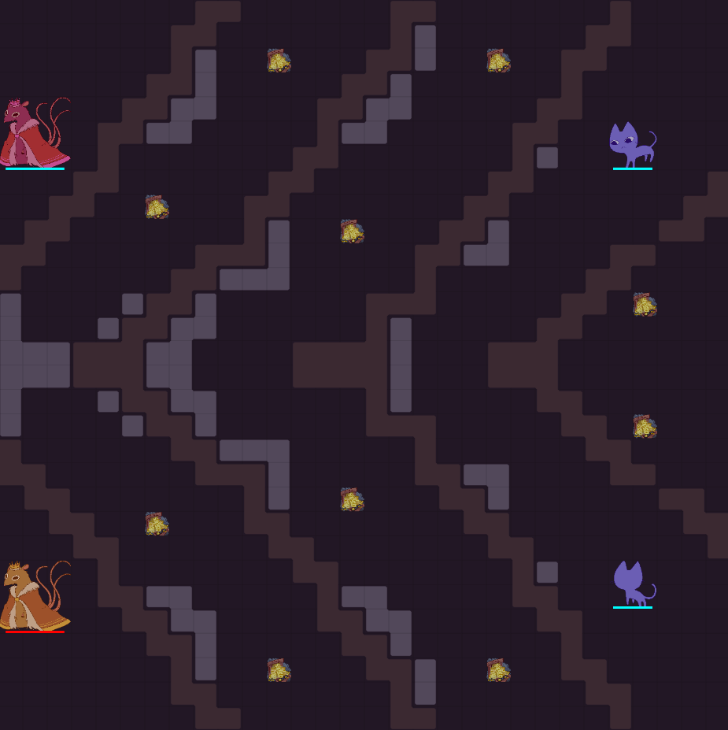
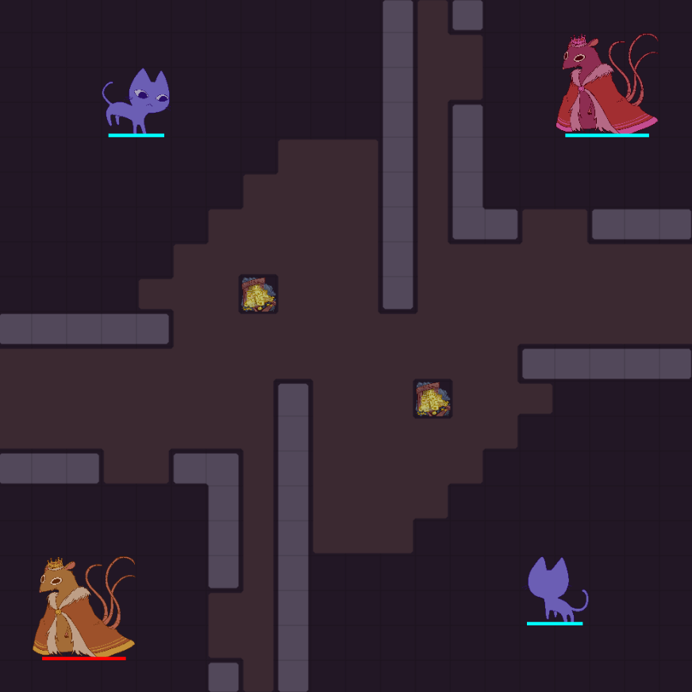

This is a brief overview of MIT Battlecode 2026's game. This year's theme was **Uneasy Alliances**.

## Game Overview
This year had two win conditions. Either kill all of the enemy's kings or have more points by the time the game ends.

The primary resource to manage was **cheese**. Many actions including spawning new units costed cheese. Other actions such as attacking could optionally consume cheese to be more effective.

## Units
### Rat King
</img>

Rat kings act as your main control center. You start the game with one, although it is possible to form new ones later on. If all of your rat kings die, you lose the game. The Rat King is the only way to produce more baby rats. Each rat kings consumes 2 cheese per turn. You could form a new rat king by spending some cheese and combining 7 baby rats contained within a 3x3 square.

### Baby Rats
</img>

Baby rats act as your workers and soldiers. Their view range is limited to only in front. Baby rats primarly carry cheese back to the king or attack enemy rats. They have significantly less health than the king, but can move much faster. New Baby Rats cost a base 10 cheese with an increasing cost for every currently alive baby rat. This means producing baby rats is more expensive the more baby rats you currently have.

### Cat
</img>

Cats were a unique introduction to this year's game. Cats are neutral units controlled by neither player. Cats would attack rats and rat kings, so it was important to develop strategies to combat cats. Dealing damage to cats could award a significant amount of points, however cats could often kill a baby rat in a single hit and also have a very large amount of health. Cats provided a significant source of variablilty in games and received many behaviour fixes and balance patches throughout the competion making dealing with them particularly difficult.

## Cooperation and Backstabing
This year had a strange new mechanic where the game started in `Cooperation` mode. However, if any rat attacked or did damage throught traps to another rat, the game would permanently enter `Backstab` mode. In `Cooperation` mode, the game could be ended prematurely by killing all cats. The way winners are decided also changes based on what mode the game ends in. In practice 99% of games would end in `Backstab` mode, however a few times in tournament we saw cooperation mode wins on chance.

## Ending the Game
There were three ways to end the game.
1. All of a team's kings died
2. All cats are killed in `Cooperation` mode
3. Round 2000 is reached

If all of your kings die, you automatically lose. Otherwise, the game is scored based on a points system calculated from total cheese collected, amount of rat kings, and damage dealt to cats. The way these factors were weighted depeneded on what mode the game eneded in.

## Cheese Mines
</img>

Cheese mines are locations on the map that produce cheese over time. An imporant aspect of the game is quickly locating cheese mines and returning cheese efficiently. 

## Traps
</img>

Both teams could place a limitted number of rat and cat traps on tiles. Placing these traps costs cheese. Cat traps also can only be placed in `Cooperation` mode. (Although there was a delay for the team who didn't trigger the backstab.) Placing rat traps effectively was an important part of combat and map control. Traps would stun and do a significant amount of damage to any rats that move nearby.

## Dirt
</img>

Dirt tile could be mined and placed by rats. Dirt is extremely useful to protect the king from the cats. However it wasn't used for much else at least among the top teams.

## Map Examples
Here's some examples of maps used currently in the ranked scrimmages.

Okay now back to our [postmortem](./index.md).

