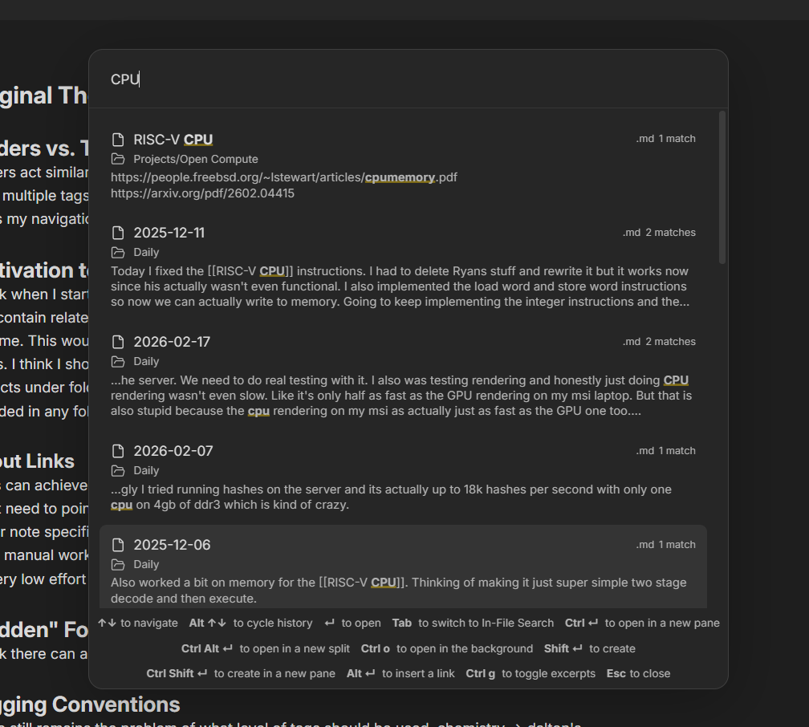
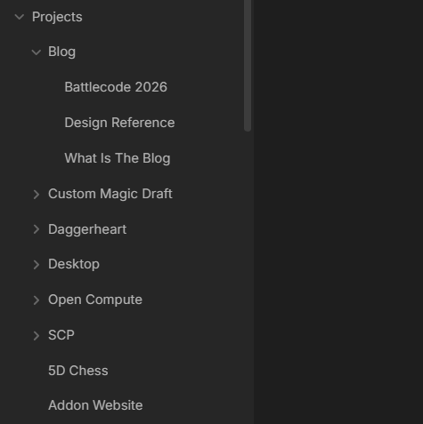
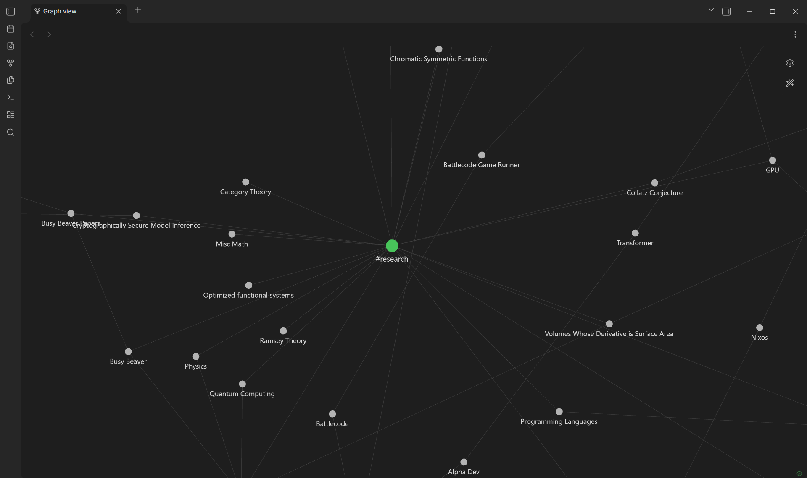

I use my Obsidian vault as the primary place to write anything. All of my class notes are taken in Obsidian. My daily journaling is in Obsidian. Records of every idea and thought I've decided to write down recently is within this Obsidian vault. I use Obsidian a lot now, and when I first started using it, I had a hard time creating notes and organizing them. Deciding what folders to put a note in and what tags to give a note was genuinely a difficult challenge making it more difficult for me to record things down for later. I now take the stance that organization should be low effort. Organization that is a lot of effort is organization I won't do.

If you search for tutorials about organizing your notes in Obsidian, there's many out there, but this one is mine. This is how I organize my notes by embracing the mess a little bit, making organization natural and low effort.

# Content is the Best Organization
Obsidian comes built in with two ways to search for notes. They're both not very good. First, theres the quick open menu. You can open it with `CTRL + O` and it allows you to search through the titles of the notes. Of course this places a large emphasis on the wording of titles and remembering which note contains that bit of information you're looking for. The other tool available is the search bar on the side. This searches the actual content of the notes, but overall it's not very good. It feels a bit clunky to use, and if you mispell or don't type the exact content correctly, it doesn't find what you're looking for. So neither of these are suitable for actually navigating notes. The good news is that there is a free community plugin that solves all of these problems, and does it very well. It's called Omnisearch.

I think that if you were really feeling lazy, you could get away with never organizing your files at all and just navigating by using Omnisearch. Omnisearch offers a direct `THOUGHT --> NOTE` sort of navigation. I get to jump directly to what I'm looking for using bits of keywords or remembered phrases.

I've sort of let the tools that I have at my disposal guide the way I organize my notes. You'll see that more coming up. I think having a good search functionality like Omnisearch is super critical especially since it (almost ironically) works regardless of how you organize your notes. In my mind, I often remember bits of what I'm looking for, or at least pieces of text nearby. That's partly what makes Omnisearch so easy to use. Worst case, I can just type in related keywords and hope what I wrote earlier shows up. I have the Omnisearch window bound to `CTRL + SHIFT + O` for easy access.

# Folders and the File Explorer
I like to use folders pretty minimally. My golden rule is that folders tend to be broad groupings of related notes. The key word here is "broad". Since a note can not exist in multiple folders, I try to avoid folder groupings that have overlap by keeping everything broad (counterintuitively). For example, the root of my project has these folders:
- Notes
- Daily
- Projects
- Meta
- Thoughts

`Notes` contains all of the notes I take in my classes. `Daily` contains all my daily notes. `Projects` contains notes with ideas and documentation for my many projects. `Meta` contains notes about my very Obsidian Vault, often about organization. `Thoughts` contains larger pieces that I write to sometimes deal with personal or relationship conflicts, if I don't write them in my daily notes.

If I have multiple notes about the same thing, I'll create a sub folder for them. For example, I have multiple notes about these blogs, so I created a `Blog` sub folder of `Projects`. An important thing to realize is, because there aren't many folders, things are super easy to change. If you're unsure if something goes in a folder, just put it there and fix it later when it becomes a problem. Often it becomes clear what works and what doesn't after just throwing things around and trying it out for a little bit. So don't worry about things being set in stone and getting it wrong the first time.

Another benefit of having a few broad folders is that it is extremely easy to decide where notes go. I'm taking notes for a class? Just throw it in the `Notes` folder. I want to write down and idea. Just throw it in the `Projects` folder. Daily notes are automatically set to be created in the `Daily` folder so I don't have to worry about that. Notes don't even have to go in a folder. Don't be afraid to just shove a note in the root until you have a better idea of where it goes later!

The benefit of using folders like this is that we get an easy way to browse semirelated notes. You get a sort of `PROJECT ---> NOTES` structure. I use this sometimes to get an idea of what I've wrote about something already. For example, if I want to remember what kinds of ideas I've recorded for the [indie game](https://store.steampowered.com/app/3115900/Rogue_Squad/) I'm working on, I can just browse the `Project Squad` folder.

# Evil Evil Tags
Tags were sort of the bane of my existance for a while. I couldn't figure out exactly how I wanted to use them. I tried using tags like folders, but with the benefit of notes being able to exist in multiple. I think this idea could work, but there wasn't a good way to view this new structure. There's a plugin that tries to accomplish this, but it didn't do a very good job in my opinion and was more of a pain to use than any actual benefit I was gaining from organizing my files like this.

I also tried tagging my notes by content like keywords. For example, I might add `#ai #machine-learning #programming #code` to a notes on a paper I read. The problem is, this required me to either know ahead of time what the note I was writing was going to contain, or go back and update the tags after I had written everything. This was a no go for me since spending extra work to maintain my organization goes against my whole philosophy of organizing.

Thus, I settled on an interesting compromise, guided by a cool feature of the iconic Obsidian graph viewer.

In the graph viewer there is an option to group nodes by tag. This gave me the brilliant (if I do say so myself) idea to use tags as functional groups. For example, I have an `#idea` tag. This means I can easily see all my ideas that I have yet to explore when I want to look back to potentially start a new project. I also have a `#research` tag so that I can easily see the different topics I have researched.

Similarly to folders, I try to keep a minimal amount of tags, and the existance of tags are primarly informed by the fact that they show up in the graph view. It's also often easier to tag notes this way because I often know the nature of what I'm writing in a note but not the exact content or ideas it contains.

Using tags in this way creates this sort of `FUNCTION ---> NOTES` relationship. I like using tags like this, but I think you could totally go without even using tags at all. It's almost just an asthetic choice. I actually have my daily notes to default with with `#daily` tag because I like seeing them all grouped in a large ball in the graph view.

# Links
I personally don't find links to be that useful. I really only use them when I want to directly reference another note in my vault. I've sort of begun using links less and less as time goes on. At the very beginning of my Obsidian vault I had this concept of `Index` pages. These were pages that would be like the main page of a project or a bunch of related notes, and then contain a bunch of links to all of them. I quickly realized this was pretty terrible because every time I had to create a new note, I had to maintain links across multiple files. This would actually lead to my current minimal work organization philosophy.

# That's It
I hope you find these methods useful. Or at least consider the idea that organization should be natural and low effort. At the end of the day, something kind of working is better than being stuck deciding on what to do still, so don't feel like you need to perfect your organization. I could definitely still improve the organization in my folder, but until it becomes a problem, I have no need to spend that extra time on it. Thanks for reading. Till next time. o7

