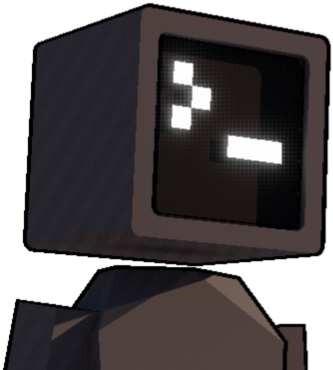

</img>

I'm Liam Hanrahan. I study Computer Science at MIT. Welcome to my spot on the internet! \\(^o^)/

Most of the time I'm working on cool [projects](./projects.md), the other half of the time I'm skiing or messing around with friends.

My dream is the browse the web on a computer designed completely by me; chip, operating system, and all. 

\> Go check out my [thoughts](./blog.md). I even have an [RSS feed!](https://outercloud.dev/rss.xml) <

"The world is as big as you want it to be. Where will you go next?" - <a href="https://youtu.be/QZ03-aaO4sA?si=iVIeU-qO1RT65t-t" target="_blank">Toby Fox</a>

